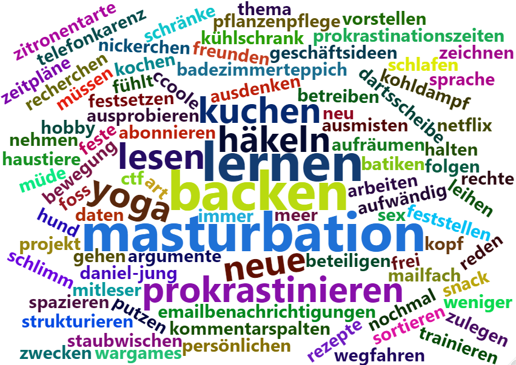
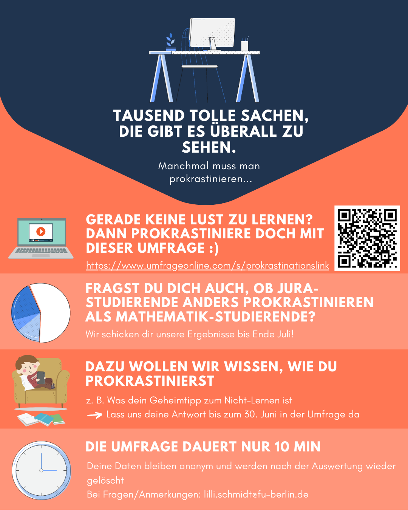

```{r setup, include=FALSE}
knitr::opts_chunk$set(echo = FALSE, message=FALSE, warning = FALSE, error = FALSE)
```

```{r, code = readLines("Abschluss_Studienbereiche.R"), echo=FALSE}
```
```{r, code = readLines("create_Datatable.R"), echo=FALSE}
```

# Introduction
- Explanation of the context.
- Research question: description, justification of relevance, and motivation.
- State and explain your hypotheses.
- Give an overview of the structure of the rest of the article.

Die Idee eine Studie über das Thema "Prokrastination" zu machen, entstand aus einer Frage, die sich viele bestimmt schon öfter gestellt haben: "Warum finde ich in der Prüfungszeit immer die besten Serien?"
Unter Prokrastination versteht man das Verschieben oder Aufschieben von anstehenden Aufgaben oder Tätigkeiten. Darunter fallen auch unnötige Ablenkungsmanöver, die von der Umsetzung der eigentlichen Tätigkeit zeitweise abhalten.
In dieser Studie betrachten wir Prokrastionation konkret nur während der Prüfungsphase und damit anfallenden Aufgaben, wie für die kommende Prüfung zu lernen.
Ziel dieser Studie war es die beliebtesten Prokrastinationstätigkeiten herauszufinden und dabei mögliche Unterschiede zwischen verschiedenen Fachbereichen und Studiengängen zu erkennen.
Dies haben wir folgendermaßen in der Forschungsfrage festgehalten: **Welche Medien nutzen Studierende je Studiengang zur Ablenkung vom Lernen in der Prüfungsphase?**
Zugegebener Maßen hat diese Forschungsfrage genrell eine eher geringe Relevanz, was allerdings nicht bedeutet, dass sie für uns persönlich irrelevant ist. Prokrastination ist vor allem in der Lernphase bei allen AutorInnen dieser Studie ein bekanntes Thema und es war uns eine willkommene Abwechslung ein für uns so interessantes und greifbares Thema das Semester über zu verfolgen. 
Da diese Studie aber aus dem Zweck entstanden ist das Format der Umfrage zu erlernen und zu üben, muss sie keine hohe Relevanz haben. Allerdings könnte diese Studie für Bereiche aus dem Marketing interessant sein, die ihre Produkte und Dienstleistungen dann möglicherweise gezielter an Studierende vermarkten könnten. 

Wir hatten die Hypothese, dass *Studierende verschiedener Fachbereiche unterschiedliche Ablenkungsmanöver nutzen*. Aufgrund der Unterschiedlichkeit der Fachbereiche und der verschiedenen Interessen der Studierenden dort, nahmen wir an, dass sich das im Prokrastinationsverhalten widerspiegeln würde.  


Im folgenden werden zuerst ähnliche Studien genannt, anschließend wird die für diese Studie genutzte Methode näher erläutert. Nach der Daten Analyse stellen wir unsere Schlussfolgerungen und Ergebnisse der Studie vor, gefolgt von einer Reflektion, in welcher darauf eingegangen wird, was wie gut funktioniert hat oder eben auch nicht.


# Related Work
+ Discussion of other possible research questions and other possible empirical methods for this area of interest.
+ Mention and cite related studies in this area.

Bei einer eher oberflächlichen Literaturrecherche, aufgrund mangelnder Zeit haben wir keine zu unserer Studienfrage sehr ähnliche Studienfrage finden können, allerdings gibt es zum Thema Prokrastination eine Vielzahl an Studien.
Zum Thema Prokrastination werden zumeist Fragen beantwortet, die den Einfluss von Prokrastination auf die Leistung untersuchen. 
So erforschen einige Studien wie sich die Leistung im Verhältnis mit der Zeit, die Prokrastiniert wurde verändert [@levy2012chais] [pychyl2000procrastination] und ob es dabei Unterschiede zwischen virtuellen Online Kursen und Anwesenheitskursen gibt [@yilmaz2017relation]. 
Dies geschieht beispielsweise in Form von Quasi Experimenten [@levy2012chais] [@yilmaz2017relation]. 
Eine weitere Umfragen-Studie erforscht in wie weit sich die Leistungen von Lernenden mit geplanten Lernverzögerungen sich von denen mit ungeplanten Lernverzögerungen unterscheiden [lindblom2015academic].
Und es gibt ebenso Studien, welche mithilfe einer Umfrage erforschen, wie Prokrastinationsverhalten gemindert werden könnte [@kristanto2016decisional].

Andere Mögliche Studienfragen, die häufiger bereits untersucht wären behandeln die Auswirkungen von Prokrastinaiton auf die Leistung, oft von Lernenden Personen.
Wir wollten eher erforschen womit und wie sich vom Lernen abgelenkt wird. Mögliche andere Forschungsfragen für uns wären gewesen:
Mit welchen sozialen Medien lenken sich Studierende ab? Mit welchen Streaming Diensten lenken sich Studierende ab? 
Allerdings wäre bei beiden dieser Fragen der Schwerpunkt eher auf genau dem abgefargtem Medium gelegen, mit welchem sich Studierende ablenken.
Dies würde kein gesamtes Bild über das prokrastinationsverhalten der Studierenden ergeben, was eine höhere Relevanz für uns hat.

Im Rahmen des Kurses haben wir die Forschungsfrage und das Thema für eine Umfrage ausgewählt.
Eine weitere Denkbare Methode für unsere Forschungsfrage, wäre das Quasi-Experiment.
In dem bspw. die Zeiten die Studierende mit verschiedenen Prokrastinationstätigkeiten verbringen, während ihrer Prüfungslernphase, dokumentiert werden würden.
Allerdings wäre diese Methode erheblich aufwendiger, wenn auch möglicherweise in den Ergebnissen ertragreicher und vor allem genauer.


# Method
Aufbauend auf der oben festgelegten Hypothese und Forschungsfrage, war der erste Schritt das Festlegen unserer Operationalität. Diese besteht aus einer gemessenen Variablen, die Messungsart sowie einem Interpretationsplan für die Ergebnisse der Messung. 

Die Zielgruppe der Teilnehmer wurde somit auf Studierende aller Fachbereiche, welche aktiv am studieren sind festgelegt. Zusätzlich wurde der Survey auf Deutsch verfasst und grenzt somit die Teilnahme auf Deutschsprachige Studierende ein. Wir wollten eine hohe Anzahl an Teilnehmern erzielen durch die Leichtigkeit des Themas sowie einer witzigen Formulierung und Durchführung. Somit waren die Sozialen Medien die perfekte verbreitunsmethode für unseren Survey. Initial wollten wir auch Mailinglisten verwenden jedoch wurde darauf hingewiesen, dass sehr viel Surveys in Zirkulation sind und somit hatten wir uns auf Discord, Twitter, Facebook und Instagram begrenzt. 

Als Variablen haben wir die Prokrastination, Prüfungszeit und Studienfach festgelegt. Darunter ist die Prokrastination eine abhängige Variable und die Prüfungszeit, sowie das Studienfach sind jeweils unabhängige Variablen. Die Prüfungszeit spiel sofern eine Rolle, dass wir nicht jegliche Prüfungszeit bewerten wollen, sondern spezifisch die letzte. Es war uns wichtig dies festzulegen, denn einerseits ist die letzte Prüfungszeit noch präsent genug, um die Fragen akkurat beantworten zu können, anderseits schließt es keine Studenten aus, welche vielleicht vor 2 Semestern die letzte Prüfung schrieben. 
Durch das Festlegen der Prokrastination als Variable, war die nächste große Frage: Wie kann Prokrastination gemessen werden? 
Die erste Idee dazu war eine Survey-Frage, welche die Studierenden um eine Angabe der geschätzten Stunden, welche sie Prokrastiniert haben anzugeben. Jedoch stellte sich sehr schnell heraus, dass dies sehr schwer zu beantworten ist, insbesondere ohne Skala. Ist es uns wichtig zu wissen wieviel pro Tag Prokrastiniert wurde oder im gesamten Prüfunszeitraum? Haben alle Fachbereiche dieselben Prüfungszeiträume und Abläufe? Können wir diese Ergebnisse dann korrekt gegenüberstellen ohne falsifizieren durch die Unterschiede? Dazu kommt das nicht jeden Tag gleichviel Prokrastiniert wird, welches die Ergebnisse auch beeinträchtigen könnte. Auch nach der Anpassung auf eine Prozentuale Einschätzung der Prokrastinationszeit blieben dieselben Probleme. Somit haben wir uns entschlossen nicht nach einer numerischen Antwort zu Fragen, sondern eher einer gefühlten Einschätzung, einerseits der Prokrastinationszeit sowie der Zufriedenheit der Prüfungsergebnisse. Damit wollten wir sehen ob viel Prokrastinieren einen negativ Eingeschätzten Erfolg verursacht oder ob wenig Prokrastiniren in eine höhere Zufriedenheit bei den Prüfungsergebnissen führt. Hier war es uns wichtig eine Persönliche Einschätzung abzufragen denn viel Prokrastiniern kann von Person zu Person unterschiedlich definiert sein, bspw. wäre 2h Prokrastinieren für eine Person viel und für eine andere sehr wenig. Um hier nicht eine Definition von „viel Prokrastination“ selbst zu definieren, und den Individualismus zu erhalten haben wir direkt nach einer persönlichen Einschätzung gefragt. Dasselbe gilt auch für die Zufriedenheit, denn eine 1,3 ist für manche fantastisch und andere schrecklich und dies können wir nicht für jeden korrekt interpretieren. 
Der zweite wichtige Anhaltspukt waren die Art der konsumierten Medien und Prokrastinationsmethoden. Somit war es wichtig die Prokrastinationsmethoden in den folgenden Kategorien zusammenzufassen: 
a)	Sport
b)	Fernsehen/Streamen/Videos/Filme schauen
c)	Smartphone nutzen
d)	Im Bett liegen
e)	Essen (z.B. kochen, backen, snacken, Foodie sein)
f)	Haushalt (z.B. putzen, umräumen, aufräumen, einkaufen, dekorieren)
g)	Kreatives Hobby (z.B. musizieren, malen, dichten, schreiben, stricken)
h)	Shoppen
i)	Ausgehen (z.B. Party, mit Freunden treffen, Kino, Dates)
j)	Computerspiele, Videospiele, Mobile Games
k)	Social Media (z.B. Facebook, Instagram, usw.)
l)	Andere Möglichkeiten (Textfeld)
Da es jedoch sehr viele Möglichkeiten hier gibt haben wir auch nach einer Eingrenzung auf die Top 3 gefragt. Der Initiale Ansatz dazu war die Einschätzung der verwendeten Zeit pro Prokrastinationsmethode, welches jedoch dieselben Problematiken aufwarf wie die Frage nach totaler Prokrastinationszeit. Da uns eher wichtig war welche Methoden am beliebtesten waren, und nicht die direkte verwendete Zeit pro Methode, genügte die Abfrage nach den 3 Favoriten. Dies liess uns indirekt darauf schliessen, dass die gewählten 3 Methoden mehr verwendet wurden wie die anderen. 
Zusätzlich wollten wir wissen welche spezifischen Social Media Services verwendet werden, falls diese als Prokrastinationsmethode gewählt wurden. Darunter hatten wir die Auswahl: Instagram, Facebook, Twitter, TikTok, Snapchat und Andere (Textfeld). Da, diese Frage nur im Survey vorkommt, wenn Social Media ausgewählt wurde wollten wir sicherstellen das Teilnehmer nicht genervt sind und somit vorzeitig abbrechen, durch doppeltes nachhacken nach ungenutzten Social Media Diensten. Dieselbe Idee haben wir angewandt, um die spezifischen Streaming-Dienste zu ermitteln, mit den folgenden Auswahlmöglichkeiten: Netflix, Amazon Prime, Disney+, DAZN, YouTube, Rakuten Viki, TV Now, Joyn, öffentlich rechtliche Mediatheken, Fernsehen, Andere (Textfeld). 
Nach der Festlegung der Hauptfragen war es wichtig die Reihenfolge festzulegen, die Teilnehmer auszusortieren welche nicht Prokrastinierten (mittels der ersten Frage), die Abfrage nach Demographischen Daten, sowie die Motivation zum weiterführen des Surveys hoch zu halten. Da wir das Interesse hoch halten wollten war es uns wichtig die Demographischen Daten am Ende abzufragen, da diese oft am Anfang abgefragt werden und somit einen negativen Eindruck durch den ganzen Survey mit sich bringen. Zusätzlich war es wichtig diese auf ein Minimum zu begrenzen, um Abbrüche am Ende zu vermeiden. Somit waren uns der Fachbereich sehr wichtig um die Forschungsfrage zu beantworten; der angestrebte Abschluss wichtig um herauszufinden ob sich das verhalten Ändert zwischen Bachelor und Master Studenten; das Hochschulsemester um festzustellen ob Studienzeit das Prokrastinationsverhalten beeinflusst; und das Alter, um festzustellen ob sich das Verhalten vom Alter beeinflusst wird. Hierfür haben wir uns grundsätzlich für Bereiche entscheiden bspw. beim Alter gab es die Auswahl, weniger als 16, 16-20, 21-25,26-30, 31-35, 35-40. Über 40 oder Keine Angabe. Diese Entscheidung kam aus der eigenen Erfahrung der AutorInnen, denn es fühlt sich eindringlicher an dies mit genauen Zahlen beantworten zu müssen wie in Bereichen. Zusätzlich genügten für die Auswertung die Angaben in Bereichen. 
Zur Motivation hatten wir vor dem Survey einerseits einen kleinen Prokrastinations-Comic und eine witzig formulierte Erklärung unserer Studie. Mitten im Survey war es uns wichtig eine Witzige Frage einzubauen, welche keinen besonderen Mehrwehrt für die Studie hatte, aber eher dazu beitragen sollte den Survey aufzuteilen und Abrechnungen zu vermeiden. Diese Frage war: «Welche Serie hast du in der vergangenen Prüfungszeit für dich entdeckt?», eine Referenz zu der initialen Studienmotivation und Chance für die Teilnehmer etwas Interessantes einzugeben. 
Nach dieser Frage kam der zweite Teil unseres Surveys, welcher sich mit der eingeschätzten Prokrastinationszeit, Zufriedenheit und Demographischen Daten beschäftigte. Zuletzt war eine weitere Witzfrage um einen Prokrastinationsgeheimtipp, welcher die Teilnehmer mit einem Lächeln lassen sollte, da sie jegliches angeben konnten. Nach der Auswertung eines anderen Teams, hatten wir den Hinweis, dass viele gerne die Ergebnisse sehen würden, somit haben wir eine 15. Frage hinzugefügt, bei welche man gerne die E-Mail angeben konnte, um die Resultate später zu bekommen. Die komplette Formulierung und Reihenfolge der Frage können in Appendix I nachgeschlagen werden. 

# Data Analysis & Results
- Number and characterization of respondents.
- Description of the approach for the data validation and analysis, short explanation of important scripts you used.
- Description of the considerations and the results of your search for scientific statements and correlations; possibly with quantitative results and/or graphic visualizations.

Test für schicke Tabelle:
```{r}
data = make.studyfields.data(c(17:28))
rownames = c("Videos", "Phone", "Bett", "Essen", "Haushalt", "Kreativhobby", "Shoppen", "Ausgehen", "Computerspiele", "Social Media", "Sonstiges")
colnames = c("MINT", "Medizin", "Kulturwiss.", "Lehramt", "Jura/BWL", "Sozialwiss", "Musik/Kunst", "Ingenieurwiss.")
create_dt(data, rownames, colnames, "Tabelle 1:", "Liebste Prokrastinationstätigkeiten (Top 3) nach Studienbereich")
```


## Qualitative Analyse
Rohdaten:
```{r, comment = ''}
geheimtipps = delete.empty.rows(umfrage, "Textfeld")
create_dt(as.data.frame(geheimtipps$Textfeld), coln = "Geheimtipps", cap = "Prokrastinationsgeheimtipps der Teilnehmenden")
```

Als Wordcloud:
```{r, fig.align='center', out.width="75%", fig.cap='Wordcloud für die genannten Prokrastinationsgeheimtipps'}

```

TODO: Kategorienbildung erklären
```{r, fig.align='center', fig.cap='Gruppierte Prokrastinationsgeheimtipps'}
knitr::include_graphics('img/gruppierung_geheimtipps.PNG')
```

Resultierende Kategorien:
```{r, comment = ''}
kats = my.read.csv(params$kat)
levels(kats$Kategorien)
```

Häufigkeit der Kategorien:
```{r, fig.align = 'center', comment = ''}
plot.for.categories()
```


# Conclusions
- Summary of the most important insights from the analysis and answer to the research question with respect to your hypotheses. If answering your research question is not possible, discuss why.
- Discussion of the threats to validity and the survey’s shortcomings as well as evaluation of credibility and relevance.

# Reflection
(not usually part of research papers)
- What did you learn from (or became aware of during) this project with respect to: choice and formulation of a research question, drafting and implementation of a questionnaire, recruitment of participants, data collection, evaluation, and drawing of conclusions?
- Evaluate your approach in view of the general approach for empiricism
(see http://www.inf.fu-berlin.de/inst/ag-se/teaching/V-EMPIR-2018/11_generic_method.pdf)

# Attachments
## Recruitment Letter
```{r, fig.align='center', out.width="75%", fig.cap='Social Media Poster als Recruitment Letter'}

```
## Questionnaire
Der Finale Fragbogen: 
1.	Hast du in der vergangenen Prüfungsphase mindestens einmal prokrastiniert, anstatt zu lernen? 
Direkte Korrelation: wir möchten wissen welcher Hobby Kategorie die Person beim prokrastinieren nachgeht.


2.	Womit hast du in deiner letzten Prüfungsphase prokrastiniert? (Mehrfachantworten möglich)
 Wir möchten wissen welchen Stellenwert das Hobby einnimmt bzw. welche 3 am beliebtesten sind, und daraus welches das 1 Prokrastinations-Hobby ist.


3.	Welche der von dir obigen ausgewählten Ablenkungsmanöver gehören zu deinen Top 3? (Mehrfachantworten möglich) 
 Direkte Korrelation: uns ist wichtig welche Services genau verwendet werden um herauszufinden ob es hier einen beliebtesten Service gibt und ob es vielleicht von international zu nationalen Studenten unterscheide gibt.


4.	Mit welchen Social-Media-Services hast du dich in der letzten Prüfungsphase abgelenkt? (Mehrfachantworten möglich) 
Die selbe Idee wie bei 3.


5.	Mit welchen Streaming-Diensten hast du dich in der letzten Prüfungsphase abgelenkt? (Mehrfachantworten möglich) 
Dies sollte eine offene Frage sein um die Interviewten direkt zu motivieren, ohne einen großen Beitrag zum Umfrage-ziel zu haben und die Teilnehmer aufzuwecken, falls sie eingeschlafen sind.


6.	Welche Serie hast du in der vergangenen Prüfungszeit für dich entdeckt?
Hier fragen wir ab, wie der Teilnehmer seine Leistung selber Einschätzt. Ohne direkt die Note abzufragen. Das hat den Vorteil, dass sich hier ein Trend gezeigt wird.


7.	Wie ist deine letzte Prüfungsphase ausgefallen, d.h. wie zufrieden bist du mit deiner Leistung?
Hier möchten wir erfahren ob der Teilnehmer sich als sehr prokrastinierend einschätzt oder nicht. Und vielleicht einschätzen ob die Person gefühlt mehr oder weniger Prokrastiniert hat im Vergleich zu anderen Studiengängen.


8.	Wie viel Zeit hast du in der letzten Prüfungsphase von deiner Lernzeit gefühlt insgesamt prokrastiniert?
Hier soll herausgefunden werden ob die Schlüsse die wir am Ende treffen werden sich auf mehrere Semester verallgemeinern lassen. Also ob das Prokrastinationsverhalten eher gleichbleibend ist oder sich ständig verändert.


9.	Unterscheidet sich dein Prokrastinationsverhalten der letzten Prüfungsphase von der vorherigen ?
Um bei der Auswertung später mögliche Unterschiede zwischen Studiengängen herausfiltern zu können bzgl. des Studienfachs.


10.	In welchen der folgenden Bereiche lässt sich dein Studienfach einordnen? (Mehrfachantworten möglich)
Um später mögliche Unterschiede zwischen verschiedenen Studiengängen (Master, Bachelor, usw.) herausfiltern zu können.

Demographische Daten der Teilnehmer für eventuelle Analyse sammeln (Nationalität und Geschlecht sind für unsere Forschungsfrage nicht relevant bzw. out of scope):

11.	Welchen Abschluss strebst du derzeit an? 

12.	In welchem Hochschulsemester bist du?

13.	Wie alt bist du?

14.	Falls uns mal die Ideen ausgehen sollten, was wir machen können, anstatt zu lernen: Wie lautet dein Prokrastinationsgeheimtipp?
Ein fröhliches Ende zum Survey.

15.	Möchtest du über die Ergebnisse dieser Umfrage informiert werden? Dann schreiben wir dir eine Email, wenn es soweit ist.
Um den Teilnehmern die Möglichkeit zu bieten die Auswertung selbst zu begutachten. 

## Raw data and analyses scripts
```{r}
create_dt(umfrage, cap = params$csv_file)
```
TODO: Scripts anhängen