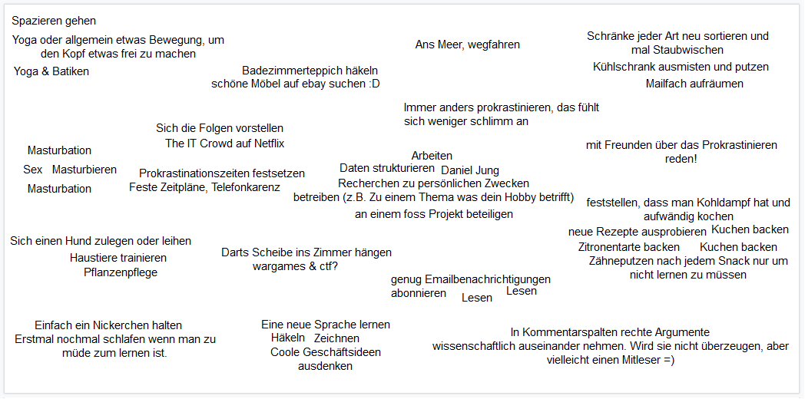

```{r setup, include=FALSE}
knitr::opts_chunk$set(echo = FALSE, message=FALSE, warning = FALSE, error = FALSE)
```

```{r, code = readLines("Abschluss_Studienbereiche.R"), echo=FALSE}
```


# Introduction
- Explanation of the context.
- Research question: description, justification of relevance, and motivation.
- State and explain your hypotheses.
- Give an overview of the structure of the rest of the article.

Die Idee eine Studie über das Thema "Prokrastination" zu machen, entstand aus einer Frage, die sich viele bestimmt schon öfter gestellt haben: "Warum finde ich in der Prüfungszeit immer die besten Serien?"
Unter Prokrastination versteht man das Verschieben oder Aufschieben von anstehenden Aufgaben oder Tätigkeiten. Darunter fallen auch unnötige Ablenkungsmanöver, die von der Umsetzung der eigentlichen Tätigkeit zeitweise abhalten.
In dieser Studie betrachten wir Prokrastionation konkret nur während der Prüfungsphase und damit anfallenden Aufgaben, wie für die kommende Prüfung zu lernen.
Ziel dieser Studie war es die beliebtesten Prokrastinationstätigkeiten herauszufinden und dabei mögliche Unterschiede zwischen verschiedenen Fachbereichen und Studiengängen zu erkennen.
Dies haben wir folgendermaßen in der Forschungsfrage festgehalten: **Welche Medien nutzen Studierende je Studiengang zur Ablenkung vom Lernen in der Prüfungsphase?**
Zugegebener Maßen hat diese Forschungsfrage genrell eine eher geringe Relevanz, was allerdings nicht bedeutet, dass sie für uns persönlich irrelevant ist. Prokrastination ist vor allem in der Lernphase bei allen AutorInnen dieser Studie ein bekanntes Thema und es war uns eine willkommene Abwechslung ein für uns so interessantes und greifbares Thema das Semester über zu verfolgen. 
Da diese Studie aber aus dem Zweck entstanden ist das Format der Umfrage zu erlernen und zu üben, muss sie keine hohe Relevanz haben. Allerdings könnte diese Studie für Bereiche aus dem Marketing interessant sein, die ihre Produkte und Dienstleistungen dann möglicherweise gezielter an Studierende vermarkten könnten. 

Wir hatten die Hypothese, dass *Studierende verschiedener Fachbereiche unterschiedliche Ablenkungsmanöver nutzen*. Aufgrund der Unterschiedlichkeit der Fachbereiche und der verschiedenen Interessen der Studierenden dort, nahme wir an, dass sich das im Prokrastinationsverhalten widerspiegeln würde.  


Im folgenden werden zuerst ähnliche Studien genannt, anschließend wird die für diese Studie genutzte Methode näher erläutert. Nach der Daten Analyse stellen wir unsere Schlussfolgerungen und Ergebnisse der Studie vor, gefolgt von einer Reflektion, in welcher darauf eingegangen wird, was wie gut funktioniert hat oder eben auch nicht.


# Related Work
- Discussion of other possible research questions and other possible empirical methods for this area of interest.
- Mention and cite related studies in this area.

grobe Notes für später
- generell gab es keine genau passende Studien
- viele Studien mit demselben Kontext
- Research Thema aber eher wie beeinflusst prokrastination die Leistung in Klausuren, wie viel prokrastination, Art der Prokrastination(geplant, ungeplant) Welche Gründe hat prokrastination? Warum tut man dies?
- oft auch Zeit projrastiniert mit exam Leistung vrglichen
- Angewandte Methoden dabei waren INterviews, Fallstudien, quasi? Experimente
- womit genau prokrastiniert wird bzw. wie viel womit und mit welchen medien wurde nicht untersucht
man zitiert so: [@smith04; @doe99].
und die Bib Datei muss im selben Verzeichnis wie der rest hier liegen

# Method
- Description of the most important considerations for the questionnaire’s de-sign (incl. discussion of problems): Formulation and order of questions, scale types, relevance as to the hypotheses
- Short description of the recruitment method for participants, including a characterization of your target group.

# Data Analysis & Results
- Number and characterization of respondents.
- Description of the approach for the data validation and analysis, short explanation of important scripts you used.
- Description of the considerations and the results of your search for scientific statements and correlations; possibly with quantitative results and/or graphic visualizations.

## Qualitative Analyse
Rohdaten:
```{r, comment = ''}
geheimtipps = delete.empty.rows(umfrage, "Textfeld")
knitr::kable(geheimtipps$Textfeld)
```

Als Wordcloud:
```{r, fig.align='center', out.width="75%", fig.cap='Wordcloud für die genannten Prokrastinationsgeheimtipps'}
knitr::include_graphics('img/wordcloud.png')
```

TODO: Kategorienbildung erklären
```{r, fig.align='center', out.width="75%", fig.cap='Gruppierte Prokrastinationsgeheimtipps'}

```

Resultierende Kategorien:
```{r, comment = ''}
kats = my.read.csv(params$kat)
levels(kats$Kategorien)
```

Häufigkeit der Kategorien:
```{r, fig.align = 'center', comment = ''}
plot.for.categories()
```


# Conclusions
- Summary of the most important insights from the analysis and answer to the research question with respect to your hypotheses. If answering your research question is not possible, discuss why.
- Discussion of the threats to validity and the survey’s shortcomings as well as evaluation of credibility and relevance.

# Reflection
(not usually part of research papers)
- What did you learn from (or became aware of during) this project with respect to: choice and formulation of a research question, drafting and implementation of a questionnaire, recruitment of participants, data collection, evaluation, and drawing of conclusions?
- Evaluate your approach in view of the general approach for empiricism
(see http://www.inf.fu-berlin.de/inst/ag-se/teaching/V-EMPIR-2018/11_generic_method.pdf)

# Attachments
## Recruitment Letter
```{r, fig.align='center', out.width="75%", fig.cap='Social Media Poster als Recruitment Letter'}
knitr::include_graphics('img/poster.png')
```
## Questionnaire
## Raw data and analyses scripts
```{r, comment = ''}
knitr::kable(umfrage, caption = params$csv_file)
```
TODO: Scripts anhängen